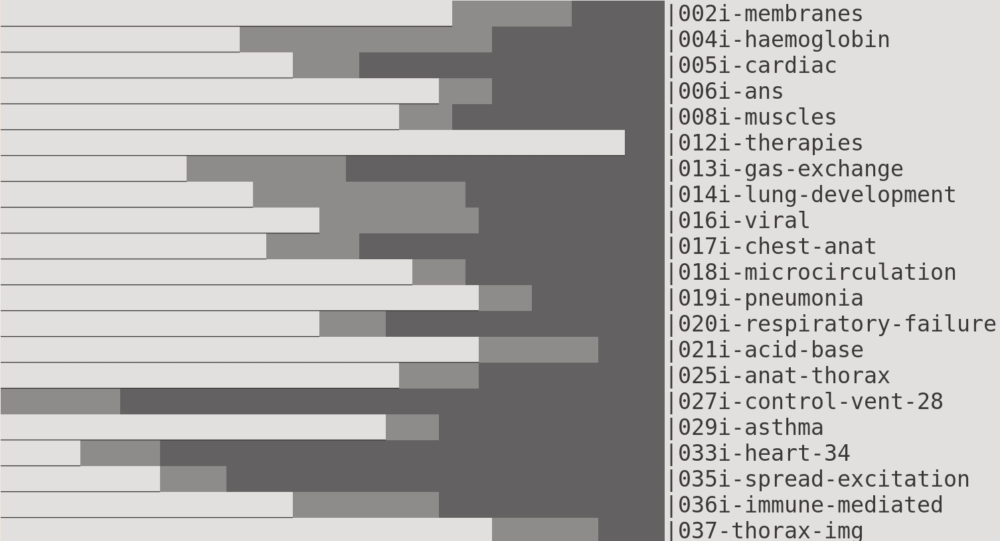
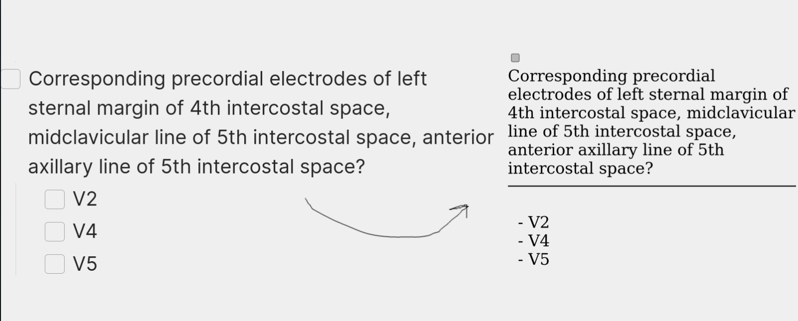
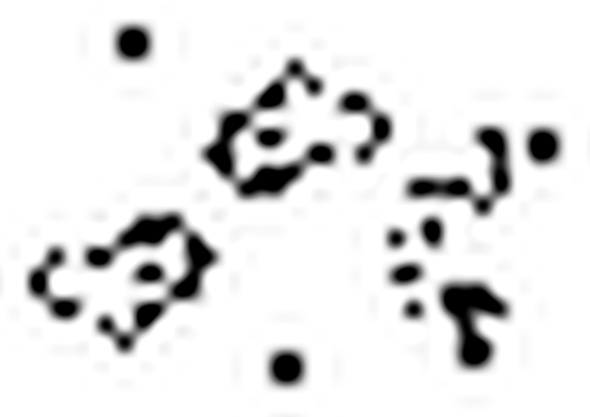
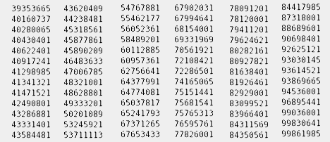
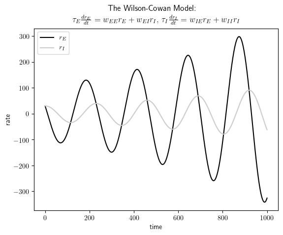
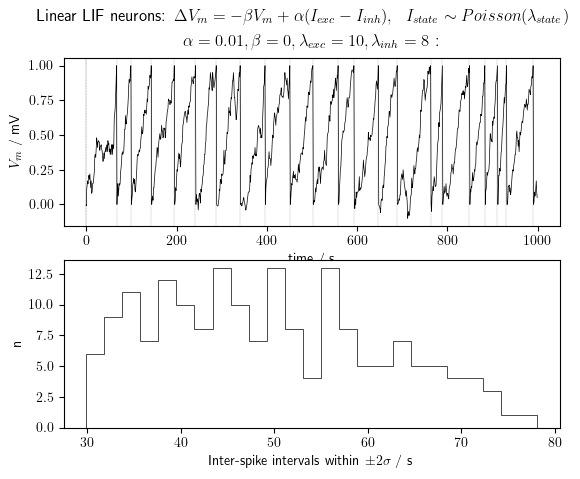

# Miscallenous scripts

### Contents:
| Name (Path)                       | Image                                | Function                                |
| --------------------------------- | ------------------------------------ | --------------------------------------- |
| Progress visualiser (medicine/progress.sh) |  | Creates bar chart that shows content per lecture, and how much is ticked off |
| Flashcard creator (medicine/file2fc.sh) |  | Transfers flashcards written with indentation in markdown to csv for Anki import |
| Tricorn Fractal   (other/tricorn.py)   |                | Conjugate set to the Mandelbrot        |
| Game of life   (other/gol.py)          |                    | Simulates Conway's cellular automata    |
| Barnsley's fern   (other/barnsley_fern.py) |               | Recreates the eponymous fractal        |
| Carmichael gen   (carmichael/carmichael.cpp) |            | Generates Carmichael numbers between given bounds |
| Wilson-Cowan model   (compneuro/wc.py)   |                     | Simulates Wilson-Cowan model (simplified) |
| Leaky Integrate and Fire   (compneuro/lif.py) |                    | Simulates a linear LIF neuron with interspike interval distribution. I/O ~ Poisson |
