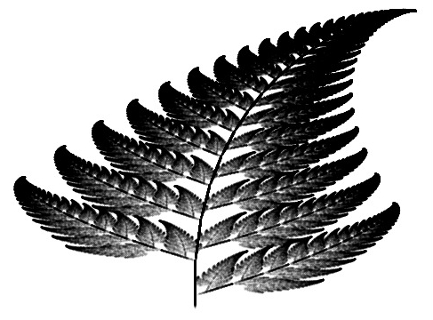

# Likeable algorithms

### Contents:
|Name | | Function |
| ----------------- | --- | ----------------------------------- |
| Tricorn Fractal |  |Conjugate set to the Mandelbrot |
| Game of life | |Simulates Conway's cellular automata |
| Barnsley's fern | |Recreates the eponymous fractal |
| Carmichael gen |  |Generates Carmichael numbers between given bounds |
| Wilson-Cowan model |  | Simulates Wilson-Cowan model (simplified) |
| Leaky Integrate and Fire |  | Simulates a linear LIF neuron with interspike interval distribution. I/O ~ Poisson |
